<div align="center">



[](https://git.io/typing-svg)

<br/>

<a href="https://shivam8897.github.io"></a>
<a href="https://www.linkedin.com/in/shivam-dubey012/"></a>
<a href="mailto:shivamdubey012@gmail.com"></a>
<a href="https://shivam8897.github.io/assets/Shivam_Dubey_Resume.pdf"></a>

<br/><br/>


</div>


## 🧠 About Me

```yaml
name:        Shivam Dubey
role:        Senior Application Development Analyst @ Accenture
location:    Hyderabad, India 🇮🇳  ·  open to relocation
arc:         Aeronautical Engineering → PL/SQL & ETL → Software Engineering
experience:  ~5 years · 2 promotions (Associate → Analyst → Senior Analyst)
domains:     Banking (Capital & Impairment, ALM, Liquidity Risk, Securitization) · Telecom · Geospatial
now:         Leading the IBM DataStage → Apache Airflow migration for NBN's TAMS
looking_for: Software Engineer roles — backend, data platform, infrastructure
```

> Aero taught me to think in systems: redundancy, failure modes, and checklists that stop small problems becoming big ones. I bring the same habits to software — jobs that recover cleanly, tests at the boundaries, and runbooks so the next engineer on call isn't guessing.


## 🚀 Selected Work

<div align="center">

<table>
<tr>
<td width="50%" valign="top">

**🛡️ [AI Data Quality Guardian](https://github.com/shivam8897/ai-data-quality-guardian)** &nbsp; 

Point it at a CSV or a live database table and it tells you what's wrong with your data, and why.

<sub>Profiles every column, flags null spikes, duplicates, Z-score and Isolation Forest outliers and schema drift, then asks Claude to explain each anomaly with a root cause and a fix. Runs on a schedule via an Airflow DAG and shows everything on a live dashboard.</sub>

<code>Python</code> <code>FastAPI</code> <code>scikit-learn</code> <code>Claude API</code> <code>PostgreSQL</code> <code>Airflow</code> <code>React</code> <code>Docker</code>

</td>
<td width="50%" valign="top">

**✈️ [Mission-Control Portfolio](https://shivam8897.github.io)** &nbsp; 

My portfolio as a data-pipeline control room, in a single HTML file with zero dependencies.

<sub>A runnable Airflow-style DAG with retries and chaos mode, a before/after EXPLAIN PLAN tuner, a working terminal, a photo that builds itself from particles, a paper-plane cursor and light-speed "warp" navigation, all hand-written with Canvas, SVG and Web Audio.</sub>

<code>JavaScript</code> <code>Canvas</code> <code>SVG</code> <code>Web Audio</code> <code>CSS</code>

</td>
</tr>
<tr>
<td width="50%" valign="top">

**📊 [Sales Analytics Pipeline](https://github.com/shivam8897/sales-analytics-pipeline)** &nbsp; 

End-to-end ETL that turns raw sales and customer data into a clean warehouse.

<sub>Extracts from REST APIs and relational sources, transforms with modular Python + SQL and built-in data-quality checks, loads into PostgreSQL, and orchestrates ETL, quality and reporting DAGs with retries and alerting.</sub>

<code>Apache Airflow</code> <code>Python</code> <code>SQL</code> <code>PostgreSQL</code> <code>Docker</code> <code>Pytest</code>

</td>
<td width="50%" valign="top">

**🔤 [Name Place Animal Thing](https://github.com/shivam8897/NamePlaceAnimalThing)** &nbsp; 

The childhood pen-and-paper word race, rebuilt as a real-time multiplayer game.

<sub>Instant rooms for 2–8 players with no account, a random letter, 30-second rounds and live scoring where unique answers score higher. Works in any browser on any device.</sub>

<code>Node.js</code> <code>Express</code> <code>Socket.IO</code> <code>Supabase</code> <code>Claude API</code>

</td>
</tr>
<tr>
<td width="50%" valign="top">

**🏦 [Dubey's Banking Management System](https://github.com/shivam8897/dubeys-banking-management-system)** &nbsp; 

A full banking back end written in PL/SQL, with a small web UI on top.

<sub>Customers, savings and current accounts, deposits, withdrawals and transfers with audit trails, loans with EMI calculation, and reporting, built on packages, procedures, functions, triggers and proper exception handling.</sub>

<code>Oracle</code> <code>PL/SQL</code> <code>SQL</code> <code>Python</code> <code>Flask</code>

</td>
<td width="50%" valign="top">

**📈 [AdventureWorks Power BI](https://github.com/shivam8897/POWER-BI-PROJECTS)** &nbsp; 

KPI dashboard for a global cycling-equipment manufacturer.

<sub>Cleans and models the raw CSVs into a relational model, builds KPI measures in DAX, and presents regional, product and customer trends with interactive slicers and filters.</sub>

<code>Power BI</code> <code>DAX</code> <code>Power Query</code> <code>Data Modelling</code>

</td>
</tr>
</table>

</div>


## 🛠️ Tech Stack

<div align="center">

[](https://skillicons.dev)

<br/>


<sub><b>Database craft:</b> execution plans · indexing · SQL hints · partitioning · BULK COLLECT / FORALL</sub><br/>
<sub><b>Delivery:</b> CI/CD with Git + Liquibase · SIT · UAT · regression · runbooks · on-call</sub>

</div>


## 💼 Experience

### 🏢 Accenture, Hyderabad *(Jul 2021 – Present)*

`Senior Application Development Analyst · Mar 2026 – now` &nbsp; `Analyst · Nov 2022 – Feb 2026` &nbsp; `Associate · Jul 2021 – Oct 2022`

| | |
|---|---|
| 🔷 | Leading the end-to-end **IBM DataStage → Apache Airflow** migration for NBN's **TAMS**, Geoscape location data for Australia's national broadband network, with **zero data loss** and **no disruption to live feeds** |
| 🔷 | Own the migration's technical design, coordinating infrastructure, database, QA and functional teams |
| 🔷 | PL/SQL packages, procedures, triggers and views tuned for **up to 50% faster queries** |
| 🔷 | CI/CD for PL/SQL + ETL with **Git and Liquibase**: **40% shorter release cycles**, no manual deployment errors |
| 🔷 | Oracle on **AWS RDS**: **20% lower operating cost** through CloudWatch monitoring and capacity planning |
| 🔷 | **Automated 80% of manual validation checks**, cutting validation time per release by 25% |
| 🏦 | **TSB Banco Sabadell**: IFRS 9 capital & impairment (**25% faster queries, 20% less resource use**) and securitization (**15% module improvement**) |
| 🏆 | **Two promotions** in about five years; mentor junior developers on PL/SQL and performance tuning |


## 🎓 Education & Certifications

| | |
|---|---|
| 🎓 | **B.Tech, Aeronautical Engineering**: MLR Institute of Technology, Hyderabad · 2021 |
| 📜 | **Oracle Certified Foundations Associate**: Oracle University, 2021 |
| 🐍 | **Python for Data Science**: IBM Developer Skills Network |
| ⚙️ | **Product Lifecycle Management**: Tata Technologies, 2020 |
| 📐 | **MATLAB Onramp**: MathWorks |


## 📊 GitHub Stats

<div align="center">

<table>
<tr>
<td>

</td>
<td>

</td>
</tr>
</table>


</div>


<div align="center">

**✈️ Cleared for takeoff. Let's build something reliable.**

<a href="https://shivam8897.github.io"></a>

</div>
